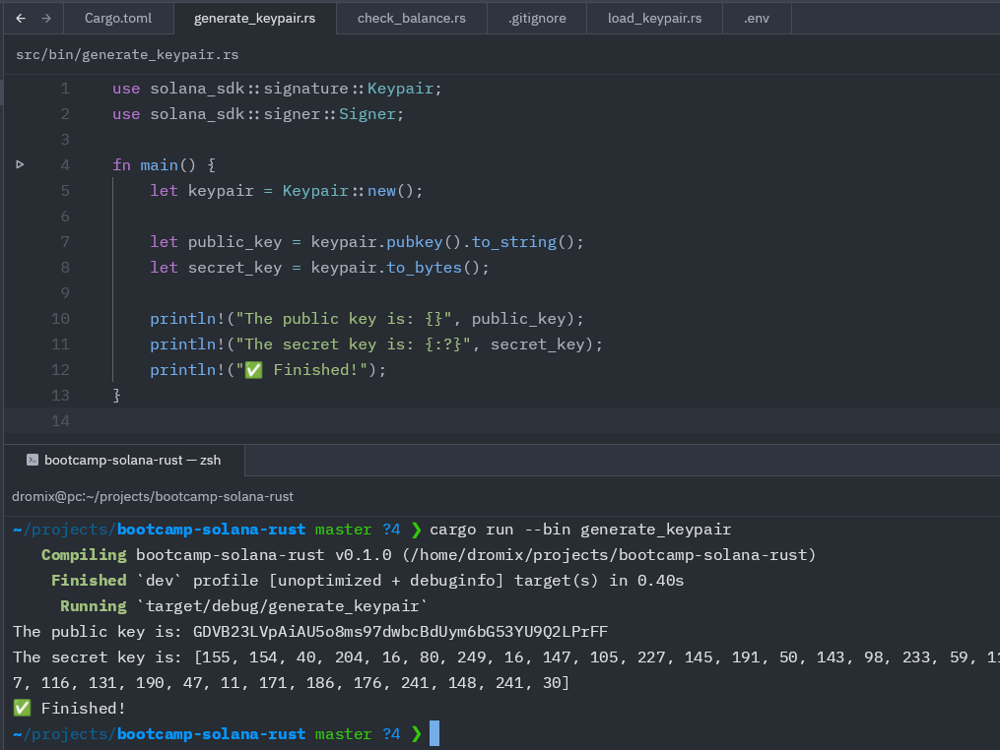
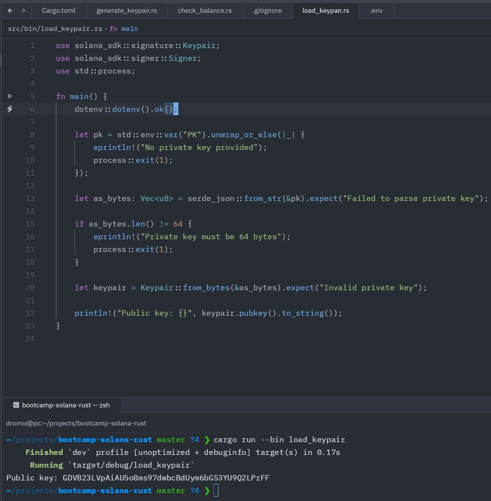
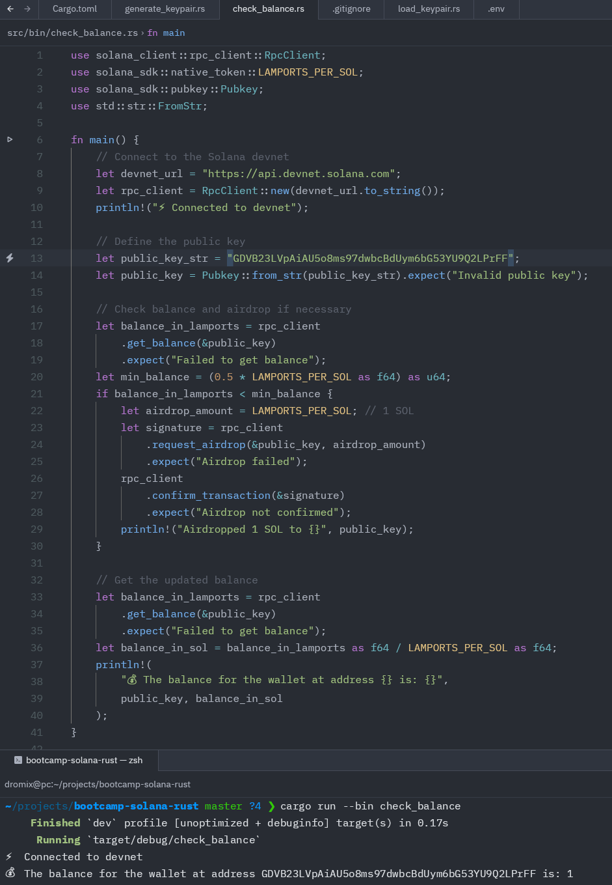

# Практика 1 - 2025-03-28

В практику 1 входять завдання 1 та завдання 2 зі слайдів.

Для практики 1 вам не потрібно завантажувати код, окрім, якщо ви виконуєте
додаткове завдання на додаткові бали.  Але ви все одно можете зберегти код всіх
лаб в цій папці для зручності.

Не забудьте, що ви маєте завантажити скріншоти виконання всіх скриптів.

Якщо ви виконуєте додаткове завдання, створіть папку для збереження коду вашого
додаткового завдання всередині цієї папки.  Наприклад, `key-grinder`, чи
`rust-exercises`, і збережіть ваш код там.  Не забудьте, що ви маєте
завантажити скріншоти виконання і для додаткового завдання, в доповнення до
коду.

## Let's rewrite it all on Rust
### Generate keypair

### Load keypair

### Airdrop check balance
